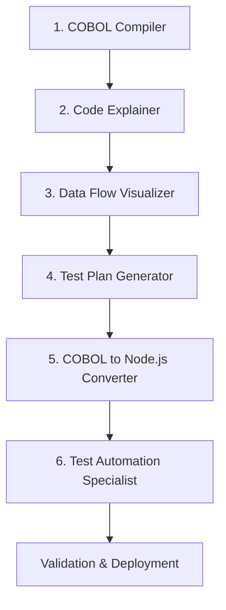

# Custom Agents for Legacy COBOL Modernization

This directory contains custom GitHub Copilot agents designed to assist with modernizing legacy COBOL applications to Node.js. Each agent is specialized for a specific phase of the modernization process.

## Overview

Based on the GitHub blog post "[Modernizing legacy code with GitHub Copilot: Tips and examples](https://github.blog/ai-and-ml/github-copilot/modernizing-legacy-code-with-github-copilot-tips-and-examples/)", this project uses custom agents to break down the modernization process into manageable, specialized tasks.

## Available Agents

### 1. 🔧 COBOL Compiler Agent
**File**: `cobol-compiler.md`

**Purpose**: Compiles and runs COBOL programs to verify functionality before modernization.

**Key Responsibilities**:
- Compile COBOL files using GnuCOBOL
- Create executable programs
- Test compiled applications
- Document compilation process

**When to Use**: At the beginning of the project to establish baseline functionality of the legacy system.

---

### 2. 📖 Code Explainer Agent
**File**: `code-explainer.md`

**Purpose**: Analyzes and explains legacy COBOL code, documenting business logic and file interactions.

**Key Responsibilities**:
- Analyze COBOL source files
- Create comprehensive documentation
- Explain file interactions
- Document business logic

**When to Use**: After compilation, to understand what the code does before modernization.

**Corresponds to Blog Step 2**: "Explain the files and code"

---

### 3. 📊 Data Flow Visualizer Agent
**File**: `data-flow-visualizer.md`

**Purpose**: Creates visual diagrams showing data flow and system architecture using Mermaid.

**Key Responsibilities**:
- Create sequence diagrams
- Generate data flow diagrams
- Visualize component relationships
- Use Mermaid format for GitHub compatibility

**When to Use**: After understanding the code, to visualize system architecture and data flow.

**Corresponds to Blog Step 3**: "Chart out the data flow between the files"

---

### 4. ✅ Test Plan Generator Agent
**File**: `test-plan-generator.md`

**Purpose**: Creates comprehensive test plans documenting business logic for validation and future testing.

**Key Responsibilities**:
- Analyze application functionality
- Create structured test cases
- Document business logic
- Generate test plans in markdown table format

**When to Use**: Before conversion, to establish testable requirements and validation criteria.

**Corresponds to Blog Step 4**: "Generate a test plan"

---

### 5. 🔄 COBOL to Node.js Converter Agent
**File**: `cobol-to-nodejs-converter.md`

**Purpose**: Converts COBOL source files to modern Node.js JavaScript applications.

**Key Responsibilities**:
- Convert COBOL files to JavaScript
- Preserve business logic
- Implement modern Node.js patterns
- Create proper project structure

**When to Use**: Main conversion phase, after documentation and test planning are complete.

**Corresponds to Blog Step 5**: "Convert the files from COBOL to Node.js"

---

### 6. 🧪 Test Automation Specialist Agent
**File**: `test-automation-specialist.md`

**Purpose**: Generates unit and integration tests for Node.js applications based on test plans.

**Key Responsibilities**:
- Generate unit tests using Jest
- Create integration tests
- Implement test cases from test plan
- Set up testing infrastructure

**When to Use**: After conversion, to validate that the Node.js version maintains the same functionality.

**Corresponds to Blog Step 6**: "Generate unit and integration tests"

---

## Recommended Workflow



### Step-by-Step Process

1. **Compile & Run** (COBOL Compiler Agent)
   - Verify the legacy system works
   - Document baseline behavior

2. **Understand** (Code Explainer Agent)
   - Analyze COBOL code
   - Document business logic

3. **Visualize** (Data Flow Visualizer Agent)
   - Create architecture diagrams
   - Map data flows

4. **Plan Testing** (Test Plan Generator Agent)
   - Document all test cases
   - Get stakeholder validation

5. **Convert** (COBOL to Node.js Converter Agent)
   - Transform code to Node.js
   - Preserve business logic

6. **Test** (Test Automation Specialist Agent)
   - Implement automated tests
   - Validate functionality

## How to Use These Agents

### On GitHub.com

1. Navigate to [https://github.com/copilot/agents](https://github.com/copilot/agents)
2. Select your repository from the dropdown
3. Click the Copilot button and select your custom agent
4. Provide your task or question

### Assigning to Issues

1. Create an issue for each modernization task
2. Assign the appropriate custom agent to the issue
3. The agent will create a pull request with the implementation

### In VS Code (as Chat Modes)

Custom agents can also be used directly in VS Code:
1. Open VS Code with GitHub Copilot extension
2. Access the Chat view
3. Use the mode dropdown to select your custom agent
4. The agent will use the same configuration

## Agent Configuration

All agents are configured with:
- **name**: Unique identifier
- **description**: What the agent does
- **tools**: Which tools the agent can access
  - `read`: Read files from the repository
  - `edit`: Modify and create files
  - `search`: Search across the codebase
  - `terminal`: Execute terminal commands

## Dependencies Required

Before using these agents, ensure you have:

- **GnuCOBOL**: For compiling legacy COBOL code
  ```bash
  brew install gnucobol  # macOS
  sudo apt-get install gnucobol  # Ubuntu/Debian
  ```

- **Node.js**: For the modernized application
  ```bash
  node --version  # Should be v18 or higher
  npm --version
  ```

- **Jest**: For testing (installed as dev dependency by Test Automation Specialist)

## Best Practices

1. **Use agents sequentially** - Follow the recommended workflow
2. **Review all outputs** - Always verify AI-generated code
3. **Commit frequently** - Save progress after each agent's work
4. **Test continuously** - Validate at each step
5. **Document decisions** - Keep notes on choices made during conversion

## Additional Resources

- [GitHub Copilot Agents Documentation](https://docs.github.com/en/copilot/how-tos/use-copilot-agents)
- [Custom Agents Configuration](https://docs.github.com/en/copilot/reference/custom-agents-configuration)
- [Modernizing Legacy Code Blog Post](https://github.blog/ai-and-ml/github-copilot/modernizing-legacy-code-with-github-copilot-tips-and-examples/)

## Contributing

To improve these agents:
1. Edit the agent markdown files in `.github/agents/`
2. Test your changes
3. Commit and push to the repository
4. The agents will be automatically updated

---

**Note**: These custom agents require a GitHub Copilot Pro, Business, or Enterprise subscription to use on GitHub.com. The free tier of Copilot can use these as chat modes in VS Code.
