# Agent Workflow Summary

## Custom Agents Created for COBOL Modernization

Based on the GitHub blog post steps, I've created **6 specialized agents** to handle the complete modernization workflow from legacy COBOL to modern Node.js.

---

## 📋 Agent Categories & Mapping

### Phase 1: Analysis & Understanding
**Agents**: COBOL Compiler, Code Explainer, Data Flow Visualizer

| Agent | Blog Step | Purpose | Tools |
|-------|-----------|---------|-------|
| **🔧 COBOL Compiler** | Step 1 | Compile and run the program | read, terminal |
| **📖 Code Explainer** | Step 2 | Explain the files and code | read, search, edit |
| **📊 Data Flow Visualizer** | Step 3 | Chart out the data flow | read, search, edit |

### Phase 2: Planning & Documentation
**Agents**: Test Plan Generator

| Agent | Blog Step | Purpose | Tools |
|-------|-----------|---------|-------|
| **✅ Test Plan Generator** | Step 4 | Generate a test plan | read, search, edit |

### Phase 3: Conversion & Validation
**Agents**: COBOL to Node.js Converter, Test Automation Specialist

| Agent | Blog Step | Purpose | Tools |
|-------|-----------|---------|-------|
| **🔄 COBOL to Node.js Converter** | Step 5 | Convert files from COBOL to Node.js | read, edit, search |
| **🧪 Test Automation Specialist** | Step 6 | Generate unit and integration tests | read, edit, search, terminal |

---

## 🔄 Complete Workflow Diagram

```mermaid
graph TB
    Start([Legacy COBOL Application]) --> A
    
    subgraph Phase1[Phase 1: Analysis & Understanding]
        A[🔧 COBOL Compiler Agent<br/>Compile & Run] --> B[📖 Code Explainer Agent<br/>Document Business Logic]
        B --> C[📊 Data Flow Visualizer Agent<br/>Create Diagrams]
    end
    
    subgraph Phase2[Phase 2: Planning & Documentation]
        C --> D[✅ Test Plan Generator Agent<br/>Create Test Cases]
    end
    
    subgraph Phase3[Phase 3: Conversion & Validation]
        D --> E[🔄 COBOL to Node.js Converter<br/>Transform Code]
        E --> F[🧪 Test Automation Specialist<br/>Implement Tests]
    end
    
    F --> End([Modern Node.js Application])
    
    style Phase1 fill:#e1f5ff
    style Phase2 fill:#fff4e1
    style Phase3 fill:#e8f5e9
    style Start fill:#ffebee
    style End fill:#c8e6c9
```



---

## 📁 File Structure

```
.github/
└── agents/
    ├── README.md                          # Complete documentation
    ├── cobol-compiler.md                  # Step 1: Compile & Run
    ├── code-explainer.md                  # Step 2: Explain Code
    ├── data-flow-visualizer.md            # Step 3: Create Diagrams
    ├── test-plan-generator.md             # Step 4: Generate Tests
    ├── cobol-to-nodejs-converter.md       # Step 5: Convert Code
    └── test-automation-specialist.md      # Step 6: Implement Tests
```

---

## 🎯 Quick Start Guide

### 1. Create Issues for Each Phase

Create GitHub issues to organize the work:

```bash
# Phase 1: Analysis
Issue #1: Compile and verify COBOL application → Use 🔧 COBOL Compiler Agent
Issue #2: Document COBOL business logic → Use 📖 Code Explainer Agent
Issue #3: Create data flow diagrams → Use 📊 Data Flow Visualizer Agent

# Phase 2: Planning
Issue #4: Generate comprehensive test plan → Use ✅ Test Plan Generator Agent

# Phase 3: Conversion
Issue #5: Convert COBOL to Node.js → Use 🔄 COBOL to Node.js Converter Agent
Issue #6: Create automated tests → Use 🧪 Test Automation Specialist Agent
```

### 2. Assign Agents to Issues

On GitHub.com:
1. Go to your repository issues
2. Click "Assign to Copilot"
3. Select the appropriate custom agent from the dropdown
4. The agent will create a PR with the implementation

### 3. Review and Iterate

Each agent will:
- Create a pull request with its work
- Document what it did
- Wait for your review and approval

---

## 🛠️ Agent Capabilities

### All Agents Can:
- ✅ Read files from the repository
- ✅ Search across the codebase
- ✅ Create and edit files
- ✅ Access chat variables (#file, #selection, etc.)
- ✅ Use slash commands (/explain, /tests, etc.)

### Some Agents Can Also:
- ⚡ Run terminal commands (COBOL Compiler, Test Automation Specialist)
- 📊 Generate Mermaid diagrams (Data Flow Visualizer)
- 🔄 Convert between languages (COBOL to Node.js Converter)

---

## 📊 Expected Outputs by Agent

| Agent | Primary Output | Secondary Outputs |
|-------|----------------|-------------------|
| COBOL Compiler | `accountsystem` executable | Compilation logs |
| Code Explainer | Documentation markdown | File analysis reports |
| Data Flow Visualizer | Mermaid sequence diagrams | Architecture docs |
| Test Plan Generator | `TESTPLAN.md` | Test case tables |
| COBOL to Node.js Converter | `main.js`, `operations.js`, `data.js` | `package.json`, README |
| Test Automation Specialist | `*.test.js` files | Jest config, coverage reports |

---

## ⏱️ Estimated Timeline

- **Phase 1 (Analysis)**: 2-4 hours
  - Compilation: 15 minutes
  - Documentation: 1-2 hours
  - Visualization: 1 hour

- **Phase 2 (Planning)**: 1-2 hours
  - Test plan creation: 1-2 hours

- **Phase 3 (Conversion)**: 4-8 hours
  - Code conversion: 2-4 hours
  - Test implementation: 2-4 hours

**Total**: 7-14 hours (compared to weeks/months without AI assistance)

---

## 🎓 Learning from the Blog

Key principles applied:

1. **Start Small** ✅
   - Each agent focuses on one specific task
   - Agents can be run independently

2. **Write Tests First** ✅
   - Test Plan Generator runs before conversion
   - Test Automation Specialist validates conversion

3. **Embrace Version Control** ✅
   - Each agent creates a separate PR
   - Easy to review and rollback

4. **Always Review Suggestions** ✅
   - All agents produce output for human review
   - Trust but verify approach

5. **Use Copilot Features** ✅
   - Slash commands documented in each agent
   - Chat variables specified in prompts
   - @workspace participant recommended

---

## 🚀 Next Steps

1. **Verify Installation**: Ensure all tools are installed (✅ Already done!)
   - GnuCOBOL: v3.2.0 ✅
   - Node.js: v22.16.0 ✅
   - npm: v11.6.2 ✅

2. **Create GitHub Issues**: One for each agent's task

3. **Start with Phase 1**: Run agents sequentially
   - Compile → Explain → Visualize

4. **Get Stakeholder Sign-off**: On test plan before conversion

5. **Convert and Test**: Complete Phase 3

6. **Deploy**: Modern Node.js application ready!

---

## 📚 Additional Resources

- 📖 [Agent Configuration Reference](README.md)
- 🔗 [GitHub Blog Post](https://github.blog/ai-and-ml/github-copilot/modernizing-legacy-code-with-github-copilot-tips-and-examples/)
- 📘 [Custom Agents Documentation](https://docs.github.com/en/copilot/how-tos/use-copilot-agents/coding-agent/create-custom-agents)
- 🎯 [COBOL Modernization White Paper](https://resources.github.com/software-development/modernizing-cobol-with-github-copilot/)

---

**Status**: ✅ All agents created and ready to use!

**Last Updated**: November 4, 2025
