# 🎯 COBOL to Node.js Modernization - Issue Tracking

## Overview
This document tracks the sequential workflow for converting the COBOL application to Node.js. Each issue must be completed in order, with code review and PR merge before moving to the next step.

---

## 📋 Issue List & Agent Assignment

### ✅ Issue #1: Compile and Verify COBOL Application
- **URL**: https://github.com/sukumarp2022/modernize-legacy-cobol-app/issues/1
- **Agent to Assign**: `cobol-compiler`
- **Phase**: 1 - Analysis & Understanding
- **Priority**: 🔴 HIGH
- **Status**: 🟡 Not Started
- **Dependencies**: None (starting point)

**What It Does**:
- Compiles the COBOL files using GnuCOBOL
- Creates the `accountsystem` executable
- Tests all functionality to establish baseline
- Documents current behavior

**Next Step After Merge**: Move to Issue #2

---

### ✅ Issue #2: Document COBOL Business Logic and Code Structure
- **URL**: https://github.com/sukumarp2022/modernize-legacy-cobol-app/issues/2
- **Agent to Assign**: `code-explainer`
- **Phase**: 1 - Analysis & Understanding
- **Priority**: 🟠 MEDIUM-HIGH
- **Status**: 🔴 Blocked (waiting for Issue #1)
- **Dependencies**: Issue #1 must be completed

**What It Does**:
- Analyzes all COBOL files (main.cob, operations.cob, data.cob)
- Documents business logic and rules
- Explains file interactions
- Creates comprehensive documentation

**Next Step After Merge**: Move to Issue #3

---

### ✅ Issue #3: Create Data Flow and Architecture Diagrams
- **URL**: https://github.com/sukumarp2022/modernize-legacy-cobol-app/issues/3
- **Agent to Assign**: `data-flow-visualizer`
- **Phase**: 1 - Analysis & Understanding
- **Priority**: 🟡 MEDIUM
- **Status**: 🔴 Blocked (waiting for Issue #2)
- **Dependencies**: Issue #2 must be completed

**What It Does**:
- Creates Mermaid sequence diagrams
- Visualizes data flow between components
- Generates architecture diagrams
- All diagrams render on GitHub

**Next Step After Merge**: Move to Issue #4

---

### ✅ Issue #4: Generate Comprehensive Test Plan
- **URL**: https://github.com/sukumarp2022/modernize-legacy-cobol-app/issues/4
- **Agent to Assign**: `test-plan-generator`
- **Phase**: 2 - Planning & Documentation
- **Priority**: 🔴 HIGH
- **Status**: 🔴 Blocked (waiting for Issues #2 & #3)
- **Dependencies**: Issues #2 and #3 must be completed

**What It Does**:
- Creates TESTPLAN.md with all test cases
- Documents expected behaviors
- Covers positive, negative, and edge cases
- Test case format ready for automation

**⚠️ CHECKPOINT**: Get stakeholder approval before Issue #5!

**Next Step After Merge**: Move to Issue #5 (after approval)

---

### ✅ Issue #5: Convert COBOL Files to Node.js
- **URL**: https://github.com/sukumarp2022/modernize-legacy-cobol-app/issues/5
- **Agent to Assign**: `cobol-to-nodejs-converter`
- **Phase**: 3 - Conversion & Validation
- **Priority**: 🔴 CRITICAL
- **Status**: 🔴 Blocked (waiting for Issue #4 + approval)
- **Dependencies**: Issue #4 must be completed and approved

**What It Does**:
- Converts main.cob → main.js
- Converts operations.cob → operations.js
- Converts data.cob → data.js
- Creates package.json and project structure
- Implements modern Node.js patterns
- Preserves exact business logic

**Next Step After Merge**: Move to Issue #6

---

### ✅ Issue #6: Generate Unit and Integration Tests
- **URL**: https://github.com/sukumarp2022/modernize-legacy-cobol-app/issues/6
- **Agent to Assign**: `test-automation-specialist`
- **Phase**: 3 - Conversion & Validation
- **Priority**: 🔴 CRITICAL
- **Status**: 🔴 Blocked (waiting for Issue #5)
- **Dependencies**: Issues #4 and #5 must be completed

**What It Does**:
- Sets up Jest testing framework
- Creates unit tests for all modules
- Creates integration tests for workflows
- Implements all test cases from TESTPLAN.md
- Generates coverage reports
- Ensures all tests pass

**Final Step**: After all tests pass, modernization is complete! 🎉

---

## 🔄 Workflow Summary

```mermaid
graph TB
    Start([Start Modernization]) --> I1
    
    I1[Issue #1: Compile COBOL<br/>Agent: cobol-compiler] --> PR1[Review PR #1]
    PR1 --> Merge1[Merge to main]
    
    Merge1 --> I2[Issue #2: Document Code<br/>Agent: code-explainer]
    I2 --> PR2[Review PR #2]
    PR2 --> Merge2[Merge to main]
    
    Merge2 --> I3[Issue #3: Create Diagrams<br/>Agent: data-flow-visualizer]
    I3 --> PR3[Review PR #3]
    PR3 --> Merge3[Merge to main]
    
    Merge3 --> I4[Issue #4: Generate Test Plan<br/>Agent: test-plan-generator]
    I4 --> PR4[Review PR #4]
    PR4 --> Approval{Stakeholder<br/>Approval?}
    
    Approval -->|Yes| Merge4[Merge to main]
    Approval -->|No| I4
    
    Merge4 --> I5[Issue #5: Convert to Node.js<br/>Agent: cobol-to-nodejs-converter]
    I5 --> PR5[Review PR #5]
    PR5 --> Merge5[Merge to main]
    
    Merge5 --> I6[Issue #6: Create Tests<br/>Agent: test-automation-specialist]
    I6 --> PR6[Review PR #6]
    PR6 --> Tests{All Tests<br/>Pass?}
    
    Tests -->|Yes| Merge6[Merge to main]
    Tests -->|No| I6
    
    Merge6 --> Complete([Modernization Complete!])
    
    style I1 fill:#e1f5ff
    style I2 fill:#e1f5ff
    style I3 fill:#e1f5ff
    style I4 fill:#fff4e1
    style I5 fill:#e8f5e9
    style I6 fill:#e8f5e9
    style Approval fill:#ffebee
    style Tests fill:#ffebee
    style Complete fill:#c8e6c9
```

---

## 📊 Progress Tracking

| Issue | Phase | Agent | Status | PR | Merged |
|-------|-------|-------|--------|----|----|
| [#1](https://github.com/sukumarp2022/modernize-legacy-cobol-app/issues/1) | Analysis | cobol-compiler | 🟡 Not Started | - | ❌ |
| [#2](https://github.com/sukumarp2022/modernize-legacy-cobol-app/issues/2) | Analysis | code-explainer | 🔴 Blocked | - | ❌ |
| [#3](https://github.com/sukumarp2022/modernize-legacy-cobol-app/issues/3) | Analysis | data-flow-visualizer | 🔴 Blocked | - | ❌ |
| [#4](https://github.com/sukumarp2022/modernize-legacy-cobol-app/issues/4) | Planning | test-plan-generator | 🔴 Blocked | - | ❌ |
| [#5](https://github.com/sukumarp2022/modernize-legacy-cobol-app/issues/5) | Conversion | cobol-to-nodejs-converter | 🔴 Blocked | - | ❌ |
| [#6](https://github.com/sukumarp2022/modernize-legacy-cobol-app/issues/6) | Validation | test-automation-specialist | 🔴 Blocked | - | ❌ |

**Legend**:
- 🟡 Not Started - Ready to begin
- 🔵 In Progress - Agent assigned and working
- 🟢 PR Ready - Pull request created, awaiting review
- 🔴 Blocked - Waiting for dependencies
- ✅ Complete - Merged to main

---

## 🎯 How to Work on Each Issue

### Step 1: Assign Agent to Issue
1. Go to the issue on GitHub
2. Click "Assign to Copilot"
3. Select the specified custom agent from dropdown
4. The agent will analyze the issue and create a PR

### Step 2: Review the Pull Request
1. Agent will create a PR with implementation
2. Review the code changes carefully
3. Test the functionality locally if needed
4. Check that deliverables match requirements
5. Request changes if needed or approve

### Step 3: Merge to Main
1. Once PR is approved and checks pass
2. Merge the PR to main branch
3. Update progress tracking table above
4. Move to next issue in sequence

### Step 4: Repeat
Continue this cycle for each issue sequentially.

---

## 📝 Important Notes

### Before Starting Issue #5 (Conversion)
⚠️ **CHECKPOINT REQUIRED**:
- Review the test plan from Issue #4
- Get stakeholder/business approval
- Ensure all test cases are documented
- Confirm business logic is accurate

### After Completing Issue #6 (Testing)
🎉 **Success Criteria**:
- All tests passing (100% pass rate)
- Code coverage > 80%
- Node.js app behavior matches COBOL exactly
- No regression in functionality
- Performance is acceptable

---

## 🚀 Quick Start Guide

### To Begin Modernization:

1. **Go to Issue #1**: https://github.com/sukumarp2022/modernize-legacy-cobol-app/issues/1

2. **Assign the Agent**:
   - Click "Assign to Copilot"
   - Select: `cobol-compiler`

3. **Wait for PR**: Agent will create a pull request

4. **Review & Merge**: Review the PR and merge to main

5. **Move to Issue #2**: Repeat the process

---

## 📚 Resources

- **Custom Agents**: See `.github/agents/` for all agent configurations
- **Agent Documentation**: `.github/agents/README.md`
- **Workflow Guide**: `.github/agents/WORKFLOW.md`
- **Blog Reference**: [Modernizing Legacy Code with GitHub Copilot](https://github.blog/ai-and-ml/github-copilot/modernizing-legacy-code-with-github-copilot-tips-and-examples/)

---

## ⏱️ Estimated Timeline

- **Phase 1** (Issues #1-3): 2-4 hours
- **Phase 2** (Issue #4): 1-2 hours + stakeholder review
- **Phase 3** (Issues #5-6): 4-8 hours

**Total Estimated Time**: 7-14 hours

**Traditional Approach**: Weeks to months

**Time Saved**: 90%+ 🎉

---

**Last Updated**: November 4, 2025

**Current Status**: Ready to begin with Issue #1

**Repository**: https://github.com/sukumarp2022/modernize-legacy-cobol-app
